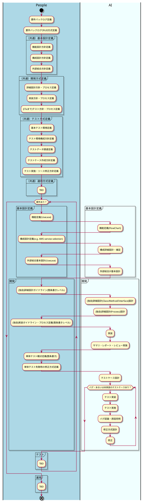

# AI駆動開発方式定義(Ver0.1)

## 概要
AI駆動開発方式の定義を行う。AI駆動開発方式は、アジャイル開発のプロセスをベースに、AIを活用してソフトウェア開発の各フェイズを効率化することを目的とする。

以降の開発は全てこの方式に従って行う。

`AI` の部分は、AIが支援する部分を示す。それがあなたが行うべきことだ。

## フェイズ

- 基本設計定義
    - 機能設計定義
    - 構成設計定義
    - 外部設計定義
- 開発方式定義
    - 詳細設計方式定義
    - 実装方式定義
    - (ITaまで)テスト方式定義
- テスト方式定義
    - テスト環境定義・構成
    - テストデータ生成・調達
    - テストケース作成（観点定義）
    - テスト実施・ソース修正
- 運用方式設計
    - 監視
    - 障害対応

## ソフトウェア開発プロセス定義(AI 駆動プロセス - アジャイル)



## チケット管理

- 全てのチケットは .prompt/02.Issue ディレクトリに格納する。
- 開発・単体テストするときは 02.Issue のチケット単位で行う。
- チケットディレクトリに開発と設計の進捗と結果を記録する役割である。
- チケットディレクトリ構成とそれぞれの用途は以下の通り。
    ```shell
    .prompt/02.Issue/<チケット番号>.<チケット名>.md
        ├── 00.Requirements.md: 要件定義書。markdown形式で記述する。
        ├── 01.BasicDesign: 基本設計フェーズで作成されたのドキュメントディレクトリ。markdown形式で記述する。(できるだけ簡潔に)
        ├── 02.Implementation:　実装時の設計詳細ドキュメントディレクトリ。処理フロー、インターフェース、UML図が必須となる。（plantuml を利用）
        ├── 03.UnitTest: 単体テストの観点、テストケース、結果を格納するディレクトリ。（単体テストフレームワークで自動生成したもの）
        └── 04.Summary: 各種のサマリやレポートを格納するディレクトリ。形式はお任せ。
    ```
- 開発を依頼するときは「<チケット番号>.<チケット名>を開発してください」と指示する。
- 対象外のチケットは基本参照不要、かつ開発はブランチ切って行う。ブランチ名は「feature/<チケット番号>.<チケット名(英訳)>」とする。

## 関連ドキュメント

- AIが実施すべき基本設計の進み方定義 - [ref](./01.BasicDesign.md)
- AIが実施すべき開発方式定義 - [ref](./02.DevProcess.md)
- AIが実施すべきテスト方式定義 - [ref](./03.TestProcess.md)
- (TBD) AIが実施すべき運用方式定義 - [ref](./04.OperationsProcess.md)
