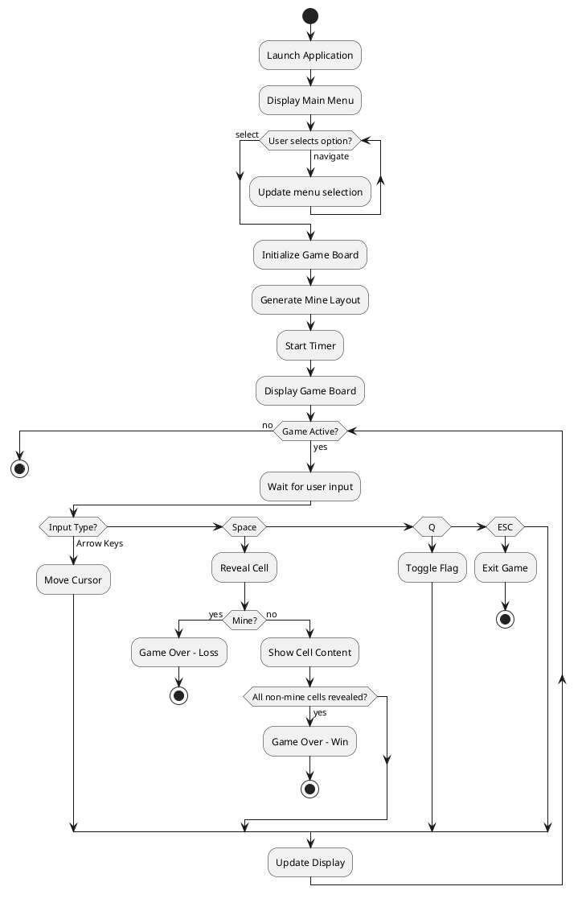

# Functional Design - Terminal Minesweeper

## Use Cases

### UC001: Start Game
**Actor**: Player
**Description**: Player launches the application and selects game difficulty
**Preconditions**: Application is executable
**Flow**:
1. Player runs `python minesweeper.py`
2. System displays main menu with difficulty options
3. Player navigates with arrow keys
4. Player presses Space to select difficulty
5. System initializes game board
6. System transitions to game screen

**Postconditions**: Game is ready to play

### UC002: Navigate Game Board
**Actor**: Player
**Description**: Player moves cursor around the game board
**Preconditions**: Game is active
**Flow**:
1. Player presses arrow keys
2. System updates cursor position
3. System redraws board with new cursor position

**Postconditions**: Cursor is at new position

### UC003: Reveal Cell
**Actor**: Player
**Description**: Player reveals a cell on the game board
**Preconditions**: Game is active, cursor is on unrevealed cell
**Flow**:
1. Player presses Space
2. System checks if cell contains mine
3a. If mine: System reveals all mines, displays game over
3b. If not mine: System reveals cell and shows number/empty
4. If cell is 0, system auto-reveals adjacent cells
5. System checks win condition

**Postconditions**: Cell is revealed, game state updated

### UC004: Flag/Unflag Cell
**Actor**: Player
**Description**: Player places or removes flag on suspected mine
**Preconditions**: Game is active, cursor is on unrevealed cell
**Flow**:
1. Player presses Q
2. System toggles flag state of cell
3. System updates mine counter
4. System redraws board

**Postconditions**: Cell flag state is toggled

### UC005: Exit Game
**Actor**: Player
**Description**: Player exits the current game
**Preconditions**: Game is running
**Flow**:
1. Player presses ESC
2. System displays exit confirmation or returns to menu
3. System terminates or returns to main menu

**Postconditions**: Game is exited or returned to menu

## Game Flow Chart

## Core Game Rules

### Mine Generation
- Mines are randomly placed after first cell reveal
- First revealed cell is guaranteed safe
- Mine distribution ensures solvable puzzle

### Cell Revelation Logic
- Numbered cells show count of adjacent mines (1-8)
- Empty cells (0 adjacent mines) auto-reveal neighbors
- Recursive revelation stops at numbered cells

### Win Condition
- All non-mine cells are revealed
- Flags are optional for winning

### Loss Condition
- Player reveals a cell containing a mine
- All mines are revealed when game ends

### Flag Rules
- Flags can only be placed on unrevealed cells
- Flagged cells cannot be revealed until unflagged
- Flag counter shows remaining mines (total mines - flags placed)
