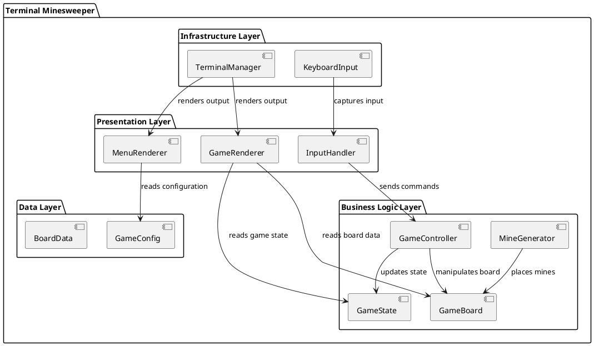

# System Architecture Design - Terminal Minesweeper

## High-Level Architecture



## Component Design

### 1. Presentation Layer

#### MenuRenderer
**Responsibility**: Render main menu and difficulty selection
**Methods**:
- `render_main_menu(selected_index: int) -> None`
- `render_difficulty_menu(difficulties: List[Difficulty], selected: int) -> None`

#### GameRenderer  
**Responsibility**: Render game board and UI elements
**Methods**:
- `render_board(board: GameBoard, cursor_pos: Tuple[int, int]) -> None`
- `render_status(game_state: GameState) -> None`
- `render_game_over(is_win: bool, time: int) -> None`

#### InputHandler
**Responsibility**: Process keyboard input and convert to game commands
**Methods**:
- `get_input() -> InputCommand`
- `handle_menu_input(key: str) -> MenuCommand`
- `handle_game_input(key: str) -> GameCommand`

### 2. Business Logic Layer

#### GameController
**Responsibility**: Main game orchestration and flow control
**Methods**:
- `start_game(difficulty: Difficulty) -> None`
- `process_command(command: GameCommand) -> None`
- `check_win_condition() -> bool`
- `handle_game_over() -> None`

#### GameBoard
**Responsibility**: Manage board state and cell operations
**Attributes**:
- `width: int, height: int`
- `cells: List[List[Cell]]`
- `mine_positions: Set[Tuple[int, int]]`

**Methods**:
- `reveal_cell(x: int, y: int) -> bool`
- `toggle_flag(x: int, y: int) -> None`
- `get_adjacent_mine_count(x: int, y: int) -> int`
- `auto_reveal_zeros(x: int, y: int) -> None`

#### GameState
**Responsibility**: Track current game status and statistics
**Attributes**:
- `status: GameStatus (PLAYING, WON, LOST)`
- `start_time: float`
- `cursor_position: Tuple[int, int]`
- `flags_placed: int`
- `cells_revealed: int`

#### MineGenerator
**Responsibility**: Generate random mine placement
**Methods**:
- `generate_mines(width: int, height: int, mine_count: int, safe_cell: Tuple[int, int]) -> Set[Tuple[int, int]]`

### 3. Data Layer

#### GameConfig
**Responsibility**: Store game configuration and difficulty settings
**Attributes**:
- `difficulties: Dict[str, Difficulty]`
- `display_settings: DisplayConfig`

#### BoardData
**Responsibility**: Core data structures for board cells
**Classes**:
- `Cell`: Contains mine status, revealed status, flag status, adjacent mine count
- `Difficulty`: Width, height, mine count configuration

### 4. Infrastructure Layer

#### TerminalManager
**Responsibility**: Terminal screen management and rendering
**Methods**:
- `clear_screen() -> None`
- `move_cursor(x: int, y: int) -> None`
- `set_color(color: Color) -> None`
- `restore_terminal() -> None`

#### KeyboardInput
**Responsibility**: Low-level keyboard input capture
**Methods**:
- `get_char() -> str`
- `setup_non_blocking_input() -> None`
- `restore_input_mode() -> None`

## Data Models

### Cell Class
```python
@dataclass
class Cell:
    has_mine: bool = False
    is_revealed: bool = False
    is_flagged: bool = False
    adjacent_mines: int = 0
```

### Difficulty Class
```python
@dataclass
class Difficulty:
    name: str
    width: int
    height: int
    mine_count: int
```

### GameStatus Enum
```python
class GameStatus(Enum):
    MENU = "menu"
    PLAYING = "playing" 
    WON = "won"
    LOST = "lost"
    EXITED = "exited"
```

## Extension Points

### 1. Theme System
- Abstract `Renderer` interface for different visual themes
- `ColorTheme` class for different color schemes
- `CharacterSet` class for different ASCII characters

### 2. Difficulty Customization
- `CustomDifficulty` builder pattern
- Configuration file support for user-defined difficulties

### 3. Statistics Tracking
- `GameStatistics` class for tracking performance
- `StatisticsManager` for persistence and analysis

### 4. Sound System (Future)
- `SoundManager` interface for audio feedback
- Platform-specific implementations

This architecture provides clear separation of concerns, making the codebase maintainable and extensible while keeping dependencies minimal.
