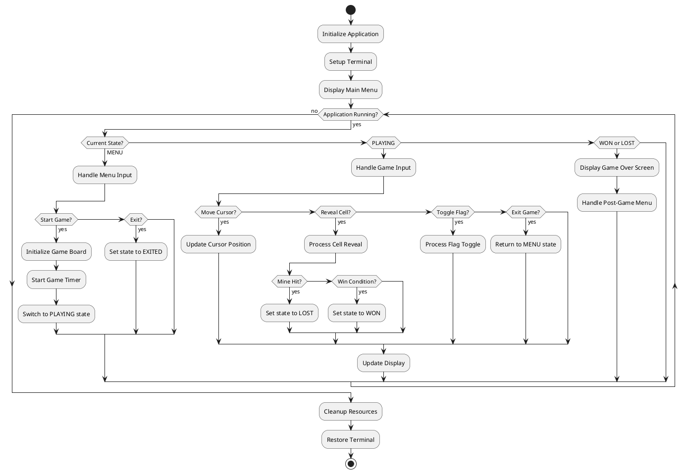

# Detailed Design - Terminal Minesweeper

## Implementation Overview

This document outlines the detailed design for implementing the Terminal Minesweeper game, following the architecture defined in the basic design phase.

## Project Structure
```
minesweeper/
├── models/
│   ├── __init__.py
│   └── game_models.py      # Core data models
├── infrastructure/
│   ├── __init__.py
│   ├── terminal_manager.py # Terminal control
│   └── input_handler.py    # Input processing
├── logic/
│   ├── __init__.py
│   ├── mine_generator.py   # Mine placement
│   ├── game_board.py       # Board operations
│   └── game_controller.py  # Game orchestration
├── presentation/
│   ├── __init__.py
│   ├── menu_renderer.py    # Menu display
│   └── game_renderer.py    # Game display
├── tests/
│   └── test_*.py           # Unit tests
└── main.py                 # Entry point
```

## Class Design

### 1. Data Models

#### Cell Class
```python
from dataclasses import dataclass
from enum import Enum

@dataclass
class Cell:
    """Represents a single cell on the minesweeper board."""
    has_mine: bool = False
    is_revealed: bool = False
    is_flagged: bool = False
    adjacent_mines: int = 0
    
    def can_reveal(self) -> bool:
        """Check if cell can be revealed."""
        return not self.is_revealed and not self.is_flagged
    
    def can_flag(self) -> bool:
        """Check if cell can be flagged."""
        return not self.is_revealed
```

#### Game Configuration Classes
```python
@dataclass
class Difficulty:
    """Game difficulty configuration."""
    name: str
    width: int
    height: int
    mine_count: int
    
    def is_valid(self) -> bool:
        """Validate difficulty parameters."""
        return (self.width > 0 and self.height > 0 and 
                0 < self.mine_count < self.width * self.height)

class GameStatus(Enum):
    """Current game state."""
    MENU = "menu"
    PLAYING = "playing"
    WON = "won"
    LOST = "lost"
    EXITED = "exited"

class InputCommand(Enum):
    """User input commands."""
    MOVE_UP = "move_up"
    MOVE_DOWN = "move_down"
    MOVE_LEFT = "move_left"
    MOVE_RIGHT = "move_right"
    SELECT = "select"
    FLAG = "flag"
    EXIT = "exit"
    INVALID = "invalid"
```

### 2. Business Logic Layer

#### GameBoard Class
```python
class GameBoard:
    """Manages the minesweeper game board state and operations."""
    
    def __init__(self, width: int, height: int, mine_count: int):
        self.width = width
        self.height = height
        self.mine_count = mine_count
        self.cells: List[List[Cell]] = []
        self.mine_positions: Set[Tuple[int, int]] = set()
        self.first_move = True
        self._initialize_board()
    
    def _initialize_board(self) -> None:
        """Initialize empty board with cells."""
        self.cells = [[Cell() for _ in range(self.width)] 
                     for _ in range(self.height)]
    
    def place_mines(self, safe_x: int, safe_y: int) -> None:
        """Place mines randomly, avoiding the safe cell."""
        pass
    
    def reveal_cell(self, x: int, y: int) -> bool:
        """Reveal cell and return True if mine hit."""
        pass
    
    def toggle_flag(self, x: int, y: int) -> bool:
        """Toggle flag on cell, return success status."""
        pass
    
    def auto_reveal(self, x: int, y: int) -> None:
        """Auto-reveal adjacent cells for zero cells."""
        pass
    
    def get_adjacent_positions(self, x: int, y: int) -> List[Tuple[int, int]]:
        """Get valid adjacent cell positions."""
        pass
    
    def calculate_adjacent_mines(self, x: int, y: int) -> int:
        """Calculate mine count for adjacent cells."""
        pass
    
    def is_valid_position(self, x: int, y: int) -> bool:
        """Check if position is within board bounds."""
        return 0 <= x < self.height and 0 <= y < self.width
    
    def get_revealed_count(self) -> int:
        """Count revealed cells."""
        pass
    
    def get_flag_count(self) -> int:
        """Count flagged cells."""
        pass
```

#### GameState Class
```python
class GameState:
    """Tracks current game status and statistics."""
    
    def __init__(self, difficulty: Difficulty):
        self.difficulty = difficulty
        self.status = GameStatus.PLAYING
        self.start_time = time.time()
        self.cursor_x = 0
        self.cursor_y = 0
        self.flags_placed = 0
        self.cells_revealed = 0
    
    def move_cursor(self, dx: int, dy: int, max_x: int, max_y: int) -> None:
        """Move cursor within board bounds."""
        self.cursor_x = max(0, min(max_x - 1, self.cursor_x + dx))
        self.cursor_y = max(0, min(max_y - 1, self.cursor_y + dy))
    
    def get_elapsed_time(self) -> int:
        """Get elapsed time in seconds."""
        if self.status == GameStatus.PLAYING:
            return int(time.time() - self.start_time)
        return self.elapsed_time
    
    def set_game_over(self, won: bool) -> None:
        """Set game over state."""
        self.status = GameStatus.WON if won else GameStatus.LOST
        self.elapsed_time = int(time.time() - self.start_time)
    
    def get_remaining_mines(self) -> int:
        """Get remaining mine count."""
        return self.difficulty.mine_count - self.flags_placed
```

#### GameController Class
```python
class GameController:
    """Main game controller orchestrating game flow."""
    
    def __init__(self):
        self.board: Optional[GameBoard] = None
        self.state: Optional[GameState] = None
        self.renderer = GameRenderer()
        self.input_handler = InputHandler()
    
    def start_game(self, difficulty: Difficulty) -> None:
        """Initialize new game with given difficulty."""
        self.board = GameBoard(difficulty.width, difficulty.height, difficulty.mine_count)
        self.state = GameState(difficulty)
        self.state.cursor_x = difficulty.height // 2
        self.state.cursor_y = difficulty.width // 2
    
    def process_input(self, command: InputCommand) -> None:
        """Process user input command."""
        if command in [InputCommand.MOVE_UP, InputCommand.MOVE_DOWN, 
                      InputCommand.MOVE_LEFT, InputCommand.MOVE_RIGHT]:
            self._handle_movement(command)
        elif command == InputCommand.SELECT:
            self._handle_reveal()
        elif command == InputCommand.FLAG:
            self._handle_flag()
        elif command == InputCommand.EXIT:
            self._handle_exit()
    
    def _handle_movement(self, command: InputCommand) -> None:
        """Handle cursor movement commands."""
        pass
    
    def _handle_reveal(self) -> None:
        """Handle cell reveal action."""
        pass
    
    def _handle_flag(self) -> None:
        """Handle flag toggle action."""
        pass
    
    def _handle_exit(self) -> None:
        """Handle exit game action."""
        pass
    
    def check_win_condition(self) -> bool:
        """Check if player has won the game."""
        pass
    
    def update_display(self) -> None:
        """Update game display."""
        self.renderer.render_game(self.board, self.state)
```

### 3. Presentation Layer

#### TerminalManager Class
```python
class TerminalManager:
    """Manages terminal display and cursor operations."""
    
    def __init__(self):
        self.original_settings = None
    
    def setup_terminal(self) -> None:
        """Setup terminal for game display."""
        pass
    
    def restore_terminal(self) -> None:
        """Restore original terminal settings."""
        pass
    
    def clear_screen(self) -> None:
        """Clear terminal screen."""
        print('\033[2J\033[H', end='', flush=True)
    
    def move_cursor(self, row: int, col: int) -> None:
        """Move cursor to specific position."""
        print(f'\033[{row};{col}H', end='', flush=True)
    
    def set_color(self, color_code: str) -> None:
        """Set text color."""
        print(color_code, end='', flush=True)
    
    def reset_color(self) -> None:
        """Reset text color to default."""
        print('\033[0m', end='', flush=True)
```

#### GameRenderer Class
```python
class GameRenderer:
    """Renders game board and UI elements."""
    
    def __init__(self):
        self.terminal = TerminalManager()
        self.colors = {
            'border': '\033[97m',  # Bright white
            'number_1': '\033[34m',  # Blue
            'number_2': '\033[32m',  # Green
            'number_3': '\033[31m',  # Red
            'flag': '\033[93m',      # Yellow
            'mine': '\033[91m',      # Bright red
            'cursor': '\033[7m',     # Inverse
            'reset': '\033[0m'       # Reset
        }
    
    def render_game(self, board: GameBoard, state: GameState) -> None:
        """Render complete game screen."""
        self.terminal.clear_screen()
        self._render_header(state)
        self._render_board(board, state)
        self._render_controls()
    
    def _render_header(self, state: GameState) -> None:
        """Render game status header."""
        pass
    
    def _render_board(self, board: GameBoard, state: GameState) -> None:
        """Render game board with cells."""
        pass
    
    def _render_cell(self, cell: Cell, is_cursor: bool) -> str:
        """Render individual cell character."""
        pass
    
    def _render_controls(self) -> None:
        """Render control instructions."""
        pass
    
    def render_game_over(self, won: bool, time: int) -> None:
        """Render game over screen."""
        pass
```

#### MenuRenderer Class
```python
class MenuRenderer:
    """Renders menu screens."""
    
    def __init__(self):
        self.terminal = TerminalManager()
    
    def render_main_menu(self, difficulties: List[Difficulty], selected: int) -> None:
        """Render main menu with difficulty selection."""
        pass
    
    def render_game_over_menu(self, won: bool, time: int, selected: int) -> None:
        """Render post-game menu."""
        pass
```

#### InputHandler Class
```python
class InputHandler:
    """Handles keyboard input and converts to commands."""
    
    def __init__(self):
        self.key_mappings = {
            '\x1b[A': InputCommand.MOVE_UP,
            '\x1b[B': InputCommand.MOVE_DOWN,
            '\x1b[C': InputCommand.MOVE_RIGHT,
            '\x1b[D': InputCommand.MOVE_LEFT,
            ' ': InputCommand.SELECT,
            'q': InputCommand.FLAG,
            'Q': InputCommand.FLAG,
            '\x1b': InputCommand.EXIT,
        }
    
    def get_input(self) -> InputCommand:
        """Get and convert keyboard input to command."""
        pass
    
    def _read_key(self) -> str:
        """Read single key from stdin."""
        pass
    
    def setup_input(self) -> None:
        """Setup non-blocking input mode."""
        pass
    
    def restore_input(self) -> None:
        """Restore normal input mode."""
        pass
```

### 4. Main Application

#### Application Class
```python
class MinesweeperApp:
    """Main application class."""
    
    def __init__(self):
        self.difficulties = {
            'Beginner': Difficulty('Beginner', 9, 9, 10),
            'Intermediate': Difficulty('Intermediate', 16, 16, 40),
            'Expert': Difficulty('Expert', 30, 16, 99)
        }
        self.controller = GameController()
        self.menu_renderer = MenuRenderer()
        self.input_handler = InputHandler()
        self.current_state = GameStatus.MENU
        self.selected_menu_item = 0
    
    def run(self) -> None:
        """Main application loop."""
        pass
    
    def handle_menu_input(self, command: InputCommand) -> None:
        """Handle menu navigation input."""
        pass
    
    def start_new_game(self, difficulty: Difficulty) -> None:
        """Start new game with selected difficulty."""
        pass
    
    def cleanup(self) -> None:
        """Cleanup resources before exit."""
        pass
```

## Implementation Flow Design



This detailed design provides a complete blueprint for implementation with clear class responsibilities and method signatures.
